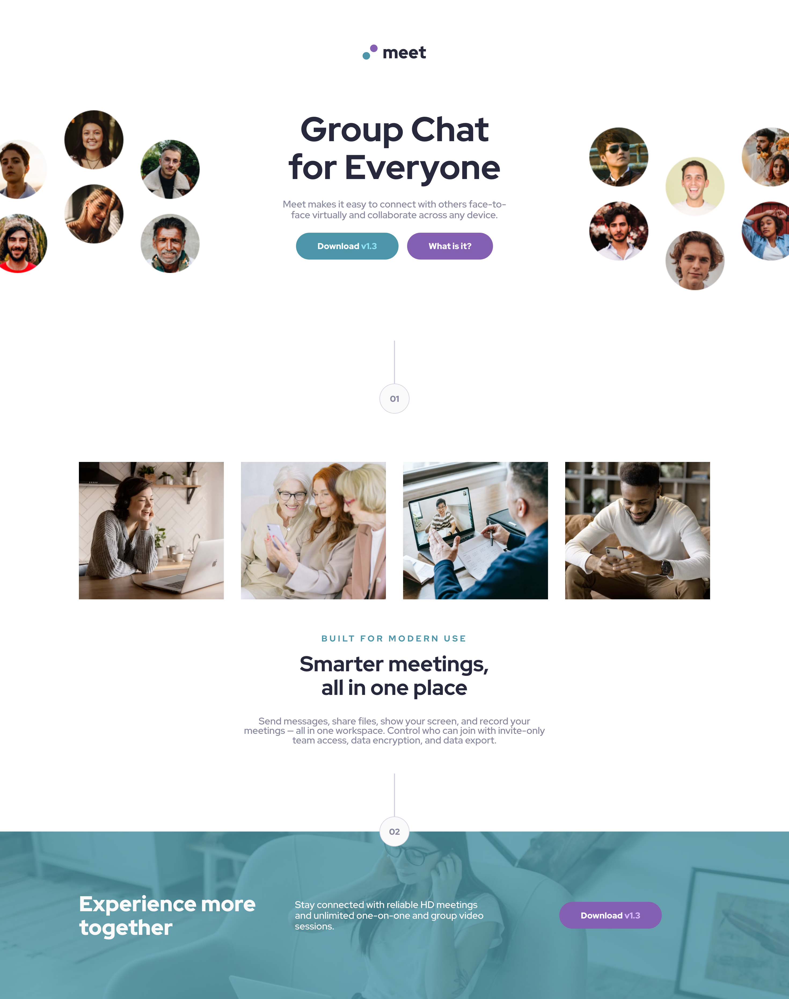

# Frontend Mentor - Meet landing page solution

This is a solution to the [Meet landing page challenge on Frontend Mentor](https://www.frontendmentor.io/challenges/meet-landing-page-rbTDS6OUR). Frontend Mentor challenges help you improve your coding skills by building realistic projects.

## Table of contents

- [Overview](#overview)
  - [The challenge](#the-challenge)
  - [Screenshot](#screenshot)
  - [Links](#links)
- [My process](#my-process)
  - [Built with](#built-with)
  - [What I learned](#what-i-learned)
  - [Continued development](#continued-development)
  - [Useful resources](#useful-resources)
- [Author](#author)
- [Acknowledgments](#acknowledgments)

## Overview

### The challenge

Users should be able to:

- View the optimal layout depending on their device's screen size
- See hover states for interactive elements

### Screenshot

### Links

- Solution URL: [Github Repo](https://github.com/dearestalexander/fm--meet)
- Live Site for DaNang Page: [DaNang on Github pages](https://dearestalexander.github.io/fm--meet/)
- Live site for Meet page: [Meet on Github pages](https://dearestalexander.github.io/fm--meet/meet)

## My process

Prior to building start by reviewing the figma design and assets, initial observations & ideas

- Structure idea: A header and 3 content areas split by 2 dividers. No obvious footer content.
- Section 1: 'Group chat for everyone' section: looks like a grid switching between 3 and 2 columns
  - Unsure of best approach to switch images other than display 'hide'
  - Also note the alignment of download/what is it buttons change, could try a flex container
- Divider between 1 and 2: A vertical line and div with radius centred in a flex container?
- Section 2:
  - 4 squares look like a grid that switches from 4 column to 2 column layout
  - Centred text below looks like a centre aligned flex area
- Divider between 2 and 3: I assume there will need to be some transform/translate to position the '2'
- Section 3:
  - This could be a grid that switches from 3 columns to 1 column

See 'what I learned' for summary of points encountered while creating the page.

### Built with

Plain HTML and CSS using grid and flexbox at various points.

### What I learned

I first built the meet page as per the specification. Then I went on to build a customised version on the theme of a tourism landing page for the city of DaNang in Vietnam.

Starting with the meet page.

1. Vertical spacing: my spacing may not match the specification precisely. I decided to attempt to get section one and section two both take up the vertical viewspace on desktop. A bit like 'above the fold'. I simply sized the hero as 100vh - the header size which I knew. I am unsure if this is considered a reasonable appraoch to this. For the section below the hero it was easy to just size that as 100vh. 
    - This caused things to 'scrunch' up on tablet / mobile, so in media queries I
      - I had to reset with height: auto
      - And then I had to add back spacing to the 'dividers'
    - I realise this isn't mobile first and there is a reliance on media queries here, but I was interested to experiment with sizing the desktop view this way.

2. Cropping of the hero image. In the spec the hero images are cropped slightly off screen at the edges. I wasn't sure of the approach for this, I guessed it could either be done by giving their container a width wider than 100vw or it could be done by adjusting their position. I went with the first approach. There's a slight difference with how the images are cropped from desktop to tablet / mobile. I had issues trying to match this exactly.

3. I did have to read up on how to apply background colours to background images. I went with the approach of using separate elements for the colour and image.

Other than the above three I found this exercise took a lot of time in that it involved several sections with a varity of grid/flex etc. and quite a few different variations of text and color.

Moving onto my own page on 'DaNang'

1. In comparison with the meet page I felt a tourism themed landing page needed a header image. I went with a landscape picture of Da Nang with the cities logo sitting on top.

2. I thought the 'headshot' section of the Hero for the 'meet' page was also a good way to showcase little images of a city / location to showcase sights, people etc. So I simply replaced the 'meet' images with some images of around Dananag.

3. In terms of spacing with the larger header I could no longer follow the same approach of having the full hero including divider on page one, but I felt how it viewed naturally on devices was okay.

### Continued development

I think there is still some scope for improvement on a few things, so I may revisit when I have more time, points I want to improve is

- Review my CSS and just check consistency of names, remove any diplication or unnecessary items
- Check / refine spacing
- Do a bit more accessibility testing.

### Useful resources

## Author

- Website - [Alexander Roan](https://www.alexroan.com)
- Frontend Mentor - [@dearestalexander](https://www.frontendmentor.io/profile/dearestalexander)
- Twitter - [@xander_roan](https://x.com/xander_roan)
